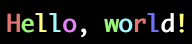

# libtermcolor

`libtermcolor` allows you to add flair to your messages with colors, italics and other graphics. Currently it supports:

- Foreground and background
- Italics and bold
- Strikethrough, underline and blinking

Documentation is provided through comments in [the header file](include/termcolor.h). See [`use.md`](doc/use.md) for more information.

The main API provided is through these three functions:

```c
int tcol_fprintf(FILE* stream, const char* fmt, ...);
int tcol_printf(const char* fmt, ...);
```

`tcol_printf` behaves the same as `tcol_fprintf` except that `stream` is by default the standard output.

These functions are exactly the same as normal printf except that you can specify colors within brackets. You can escape left brackets with `{{`.

The color is specified within a left and right bracket. There can be as many spaces as you want, but other than that it must only contain valid character sequences. [`use.md`](doc/use.md) explains these sequences in full.

The following code displays `"Hello, world!"` in rainbow colors, all bold:

```c
int result = tcol_printf("{+}{R}H{G}e{Y}l{C}l{M}o{W}, {G}w{C}o{R}r{B}l{W}d{Y}!{0}\n");
if (result != TermColorErrorNone) {
    printf("error: %s\n", tcol_errorstr(result));
    return 1;
}
```



## Building

First, clone the repo and move in it

```sh
git clone https://github.com/euppal/libtermcolor
cd libtermcolor
```


To build libtermcolor, use

```
make
```

this will build the static and dynamic libraries, along with a test program (called demo).

you can build the static library using make static and the dynamic one with `make dynamic` and `make static`
